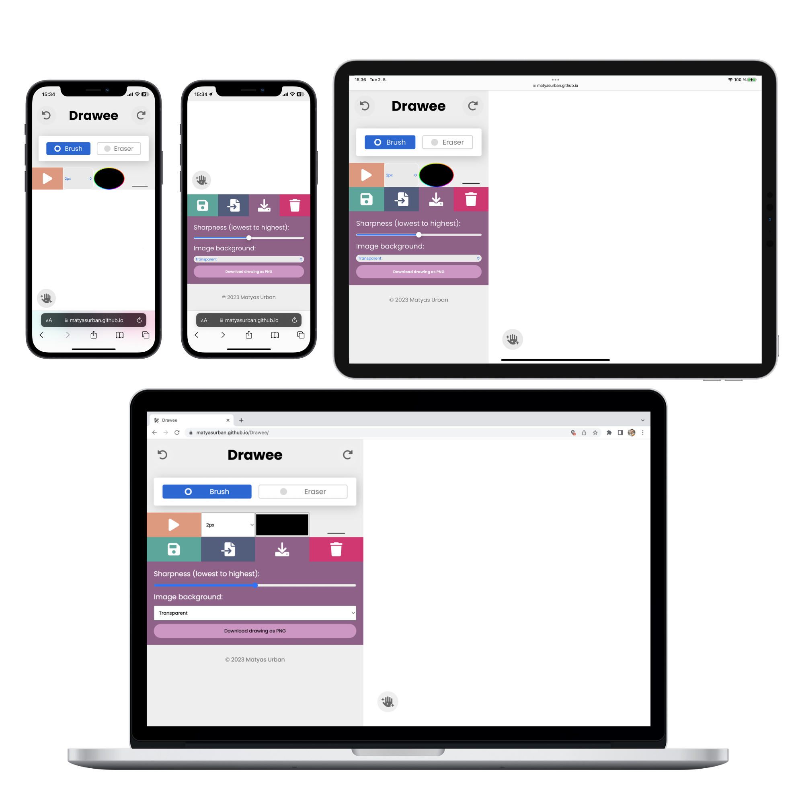
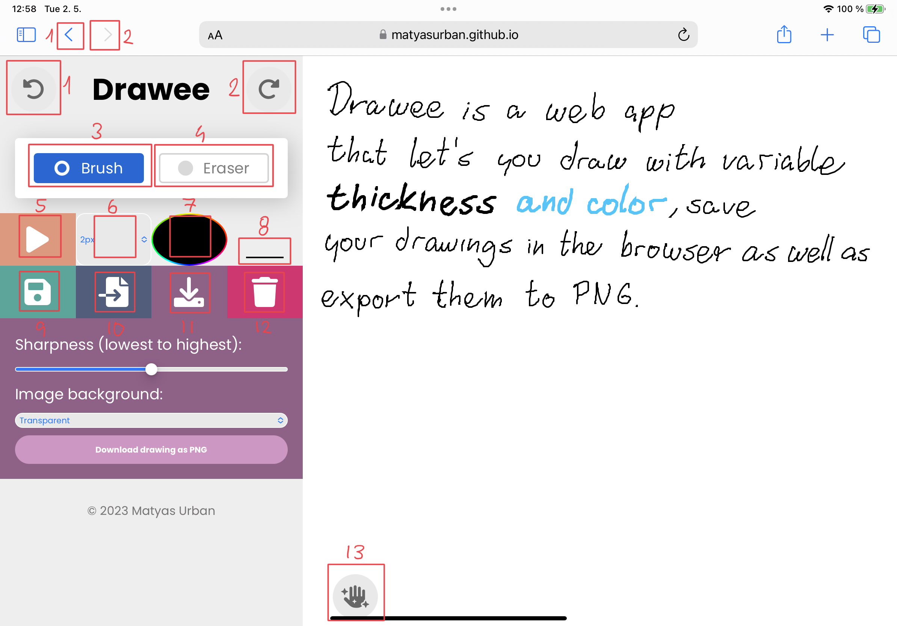

# JavaScript Drawing Web App | Drawee

This is my semester project in *Client Applications in JavaScript*  [B0B39KAJ](https://bilakniha.cvut.cz/cs/predmet3132206.html#gsc.tab=0) course as part of my Software Engineering undergraduate curriculum at the Czech Technical University in Prague, CZ, EU.

Designed, developed and programmed by  [Matyas Urban](https://www.linkedin.com/in/matyasurban/)  in Spring 2023.

* **You can view the live app here:** [https://matyasurban.github.io/Drawee/](https://matyasurban.github.io/Drawee/)
* _Note that the app asks for location permission and due to the static nature of the app, which runs just on the client (your device), it is safe to allow the location access._

## App Overview
### Key Features and Functionality
The application includes the following key features and functionality:
* Drawing on an SVG canvas with customizable stroke color and width using mouse or touch.
* Erasing strokes from the SVG canvas using mouse or touch.
* Media playback special sounds while drawing and erasing.
* Undo and redo actions integrated with the browser's history API (back and next buttons serve as undo/redo.
* Saving, loading, and deleting drawings using the browser's local storage.
* Exporting drawings as PNG images with customizable quality and background color.
* Responsive design and media queries for optimal user experience on various devices.
* Advanced CSS techniques, such as pseudo-classes, combinators, transforms, and animations.
* Especially toast animations as feedback for user interaction.
* Online and offline detection, with appropriate user notifications.
* Pausing and resuming activities based on page visibility.
* Location-based content translation using geolocation. When the location detected is in Czechia, the app will translate some labels into Czech.
### Navigation

0. **The big white square on the left** represents the drawing board. When you touch it with finger or with mouse down, it will apply the selected action.
1. **Undo**: Both wheel left and the browser's default back button remove the last stroke. Note that when you are brushing, an appropriate sound plays.
2. **Redo**: Both wheel right and the browser's default next button apply the removed stroke. Note that when you are erasing, an appropriate sound plays.
3. **Brush**: This radio option activates the brush tool.
4. **Eraser**: This radio option actives the stroke eraser (when you move over a stroke with an eraser, it will be removed).
5. **Video**: This button presents overlay with an educational video on drawing sources from YouTube. There will be an x button in the upper right corner to close the overlay, but make sure to stop playing the video first.
6. **Stroke** **Width**: This lets you set the desired width for brush.
7. **Stroke** **Color**: This lets you select the desired brush color.
8. **Stroke** **Preview**: Here you can see how will your stroke look like. It is updated when you change 6 or 7.
9. **Save**: This opens a form, which lets you save the content of svg board into the browser (for later viewing or editing). You need to enter a name first (1 to 30 characters).
10. **Load**: This opens a form, which lets you load a saved svg drawing from browser's history. You need to select the drawing first.
11. **Export**: This opens a form, which lets you download the content of the svg board into a PNG file. You need to select sharpness (1 to 5, with 1 being as is seen now, and scaling it up to 5 for higher resolution) and background (transparent/white/black) first.
12. **Delete**: This opens a form, which lets you delete a saved svg drawing from browser's history. You need to select the drawing first.
13. **Clear**: This button clears the entire svg board from all strokes.
## Technical Overview
More detailed description of implemented tech features follows.
### Website Structure (HTML)
The drawing application's website structure is built using HTML, including semantic elements to improve accessibility and provide a better understanding of the content. The application conforms to W3C validity standards and ensures proper usage of elements like SVG and media.

* **Semantic Elements**: Semantic elements such as `<header>`, `<nav>`, `<main>`, and `<footer>` are used to give meaning to the structure of the HTML document. They provide a clear organization of content and improve accessibility for screen readers.
* **W3C Validity**: The application conforms to W3C validity standards, ensuring that the HTML as well as CSS structure is well-formed and adheres to best practices. This enhances cross-browser compatibility and improves the overall quality of the code.
* **SVG**: The application uses Scalable Vector Graphics (SVG) for the drawing canvas, enabling high-quality graphics rendering and smooth scaling. SVG is an XML-based vector image format that allows for easy manipulation of graphics through DOM manipulation.
* **Media**: The application contains a form with various input types, including range, submit, select, and others. Form elements include validation attributes such as required and placeholder to guide user input and ensure data integrity. Additionally, the application uses media elements like video to provide an interactive experience for users.
### Website Design (CSS)
The application's styling is achieved using CSS, with a focus on responsiveness, media queries, advanced pseudo-classes, and combinators. It also incorporates transforms, animations, and vendor prefixes to ensure compatibility across various browsers and devices.

* **Responsiveness and Media Queries**: The application uses responsive design techniques and media queries to adapt its layout and appearance to different screen sizes and devices. This ensures an optimal user experience on various platforms.
* **Advanced Pseudo-Classes and Combinators**: The CSS for the application utilizes advanced pseudo-classes, such as `:nth-child` and `:active`, and combinators like the child combinator (`>`) and specified type (`input[type='submit']`) to target specific elements and apply styles based on their state or relationship to other elements. This allows for greater control over the application's appearance and behavior.
* **Transforms and Animations**: The application uses CSS transforms and animations (keyframes and transitions) to create smooth, engaging visual effects. These animations enhance the user experience and make the application more visually appealing.
* **Vendor Prefixes**: Vendor prefixes are used in the CSS to ensure compatibility with different browsers. This ensures that the application's styles and animations work correctly across various browser versions.
### Website Logic (JavaScript)
The application's logic is implemented using modern JavaScript features, object-oriented programming (OOP) achieved through modules, and several advanced Web APIs to enhance the user experience and improve the overall functionality of the application.

#### Modern Language Use and OOP
* The JavaScript code uses modern language features, such as **modules, arrow functions, async/await, and event handling**, to create a clean and maintainable codebase.
* The application is structured using **OOP principles**, with modules providing encapsulation and organization of functionality.
#### Advanced Web APIs
The application leverages various advanced Web APIs to extend its capabilities:

* **Pointer Events API**: Handles user interactions with the drawing canvas, enabling the drawing functionality.
* **History API**: Integrates with the browser's history API to enable the back and next buttons to function as undo and redo actions, providing a familiar and intuitive interface for users.
* **Geolocation API**: Determines whether the user is located in Czechia, and if so, translates the application's text into Czech.
* **Page Visibility API**: Handles visibility changes, such as pausing animations when user leaves the tab to improve performance.
* **Local Storage API**: Saves drawings and their associated history stacks, allowing users to load, export, and delete their saved drawings.
* **Navigator API**: Detects the user's online/offline status and adjusts the application's behavior accordingly, ensuring a seamless experience even when the internet connection is unstable or unavailable.
* **Media API**: Controls audio playback for drawing and erasing actions, providing auditory feedback to users.
* **SVG DOM Manipulation**: Interacts with the SVG elements to enable drawing, undo/redo functionality, and exporting the SVG content as a PNG image.